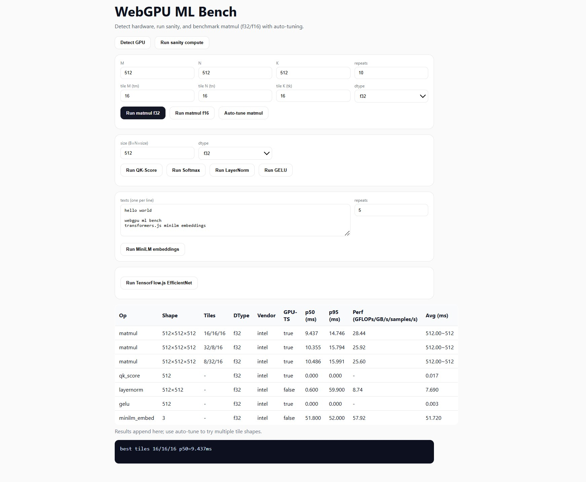

# WebGPU-ML-Bench

**Browser-based GPU benchmarking for ML Ops**
This project benchmarks custom machine-learning kernels: matmul, GEMV, softmax, layernorm, GELU, QK-Score and end-to-end models: Transformers.js MiniLM, TensorFlow\.js EfficientNet directly in the browser on AMD, NVIDIA and Intel GPUs using WebGPU.



---

## Features

* GPU detection: reports vendor, adapter, and supported features (`shader-f16`, `timestamp-query`).
* Custom WGSL kernels: matmul, GEMV, softmax, layernorm, GELU, QK-Score.
* Benchmark metrics:

  * Warmup + repeat runs
  * p50, p95, avg latency
  * GFLOPs / GB/s (for micro-kernels)
  * Samples/sec (for end-to-end models)
* Auto-tuning for matmul tile sizes optimized per vendor.
* Correctness checks for kernel outputs.
* End-to-end ML benchmarks:

  * Transformers.js MiniLM embeddings on WebGPU
  * TensorFlow\.js EfficientNet on WebGPU
* Works across vendors: AMD, NVIDIA, Intel, Apple M-series.

---

## Installation

Clone the repository and install dependencies:

```bash
git clone https://github.com/yourname/webgpu-ml-bench.git
cd webgpu-ml-bench
npm install
```

Run the dev server:

```bash
npm run dev
```

Open `http://localhost:5173` in a WebGPU-enabled browser (Chrome Canary with `--enable-unsafe-webgpu`, Safari Tech Preview, or Firefox Nightly).

---

## Usage

* Detect GPU: shows vendor and supported features
* Sanity compute: runs a simple WGSL shader
* Matmul: run f32/f16 kernels or auto-tune tile sizes
* Other kernels: GEMV, Softmax, LayerNorm, GELU, QK-Score
* MiniLM embeddings: run sentence embeddings with Transformers.js
* EfficientNet: benchmark TensorFlow\.js EfficientNet classification

Results appear in a table with shape, dtype, vendor, latency stats and throughput.
